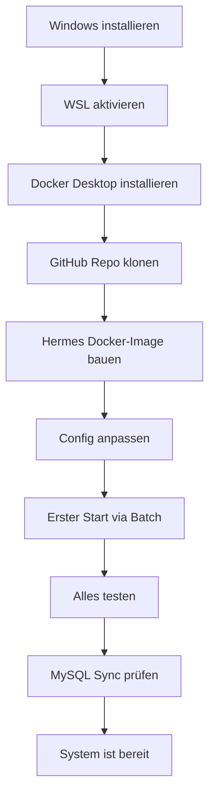

# Hermes Agent – Komplette Installation auf einem Kunden-System

Dieses Dokument beschreibt die **vollständige Erstinstallation** von Hermes Agent
auf einem Windows-System. Folge der Reihenfolge – jeder Schritt baut auf dem
vorherigen auf.

---

## Voraussetzungen

| Anforderung | Mindestens | Empfohlen |
|-------------|-----------|-----------|
| Betriebssystem | Windows 10 Pro 22H2 | Windows 11 Pro |
| Arbeitsspeicher | 16 GB RAM | 32 GB RAM |
| Prozessor | 4 Kerne | 8+ Kerne |
| Festplatte | 50 GB frei | 100+ GB SSD |
| Internet | Ja (für Downloads) | 50+ Mbit/s |
| CPU-Virtualisierung | Aktiviert (BIOS) | – |

**Vorinstallierte Software (wird später eingerichtet):** Keine.

---



---

## Phase 1 – Grundsystem einrichten

### Schritt 1: WSL aktivieren

**Dauer: ~5 Minuten**

Öffne **PowerShell als Administrator** und führe aus:

```powershell
wsl --install -d Ubuntu
```

Nach dem Befehl:
- System startet ggf. neu
- Nach dem Neustart öffnet sich automatisch ein Ubuntu-Terminal
- **Benutzername und Passwort für Ubuntu festlegen** (merken!)
- Dies ist dein WSL-Linux-Benutzer, nicht dein Windows-Benutzer

**Prüfen ob erfolgreich:**

```powershell
wsl -l -v
```

Ausgabe sollte zeigen:
```
  NAME      STATE           VERSION
* Ubuntu    Running         2
```

**Fehlerbehebung:** Falls `wsl` nicht gefunden wird, muss das Windows-Subsystem aktiviert werden:

```powershell
dism.exe /online /enable-feature /featurename:Microsoft-Windows-Subsystem-Linux /all /norestart
dism.exe /online /enable-feature /featurename:VirtualMachinePlatform /all /norestart
```
Danach **Windows NEU STARTEN**, dann `wsl --install -d Ubuntu` wiederholen.

---

### Schritt 2: Docker Desktop installieren

**Dauer: ~10 Minuten**

1. Lade Docker Desktop herunter: https://www.docker.com/products/docker-desktop/
2. **Installiere Docker Desktop** (Standardeinstellungen übernehmen)
3. Nach der Installation:
   - Hake **"Use WSL 2 instead of Hyper-V"** an
   - Docker Desktop startet automatisch
   - Warte bis unten links "Engine running" steht

**Prüfen ob erfolgreich:**

```powershell
docker --version
docker compose version
```

Beide sollten eine Versionsnummer ausgeben, kein Fehler.

**Wichtig:** Docker Desktop muss nach jedem Windows-Neustart einmal manuell gestartet werden (oder als Autostart eingerichtet).

---

### Schritt 3: Docker in WSL integrieren

**Dauer: ~2 Minuten**

Öffne Docker Desktop → Einstellungen (Zahnrad) → **Resources → WSL Integration**

- Schalte den Schalter für **Ubuntu** ein
- Klicke **Apply & Restart**

**Prüfen ob erfolgreich:**

```powershell
wsl docker ps
```

Muss eine leere Liste anzeigen (kein Fehler).

---

### Schritt 4: GitHub Repository klonen

**Dauer: ~2 Minuten**

Das Repository enthält alles Nötige: Start-Batch, Sync-Script, Anleitungen.

```powershell
cd D:\
git clone https://github.com/delkim2003/hermes-install.git hermes
cd D:\hermes
```

**Ergebnis:** Ordner `D:\hermes\` mit allen Installationsdateien.

---

### Schritt 5: Hermes Docker-Image bauen

**Dauer: ~10-20 Minuten (abhängig von Internetgeschwindigkeit)**

Das Hermes-Image wird von Grund auf gebaut. Einmaliger Vorgang.

**In WSL:**

```bash
cd /mnt/d/hermes
docker build -t hermes-agent:latest .
```

Oder wenn das Image von einer anderen Quelle kommt (z. B. Backup oder Download), entsprechend bereitstellen.

Ausgabe sollte am Ende zeigen:
```
=> => naming to docker.io/library/hermes-agent:latest
```

**Fehlerbehebung:** Falls kein Dockerfile vorhanden ist, muss vorher ein Hermes-Agent-Setup her. Lade den Hermes Agent vom offiziellen Repository:

```bash
git clone https://github.com/nousresearch/hermes-agent.git /tmp/hermes
docker build -t hermes-agent:latest /tmp/hermes
```

---

## Phase 2 – Konfiguration anpassen

### Schritt 6: Konfigurationsdateien vorbereiten

**Dauer: ~5 Minuten**

Öffne `D:\hermes\hermes_start.bat` im Editor und passe diese Variablen an:

```batch
:: === KUNDENSPEZIFISCHE ANPASSUNGEN ===
set "API_KEY=mein-sicherer-api-key"
set "CPASS=mein-cryptomator-passwort"
set "MPASS=mein-mysql-root-passwort"
set "PROVIDER=openrouter"
set "MODEL=anthropic/claude-sonnet-4"
set "WEBUI_NAME=Meine Firma - Hermes"
```

**Erklärung:**
| Variable | Beschreibung |
|----------|-------------|
| `API_KEY` | Beliebiges Passwort für den Hermes-API-Zugriff (Open WebUI braucht das) |
| `CPASS` | Cryptomator-Vault-Passwort (falls verwendet) |
| `MPASS` | MySQL-Root-Passwort für die Datenbank |
| `PROVIDER` | Z. B. `openrouter`, `anthropic`, `openai` (je nach Anbieter) |
| `MODEL` | Das KI-Modell z. B. `anthropic/claude-sonnet-4` oder `gpt-4o` |
| `WEBUI_NAME` | Anzeigename in Open WebUI oben links |

**Mehrere Konfigurationen:** Lege einfach mehrere Batch-Dateien an:
- `hermes_kunde1_start.bat`
- `hermes_kunde2_start.bat`

Jede mit eigenem API-Key, Passwort und Modell.

---

### Schritt 7: Cryptomator Vault vorbereiten (optional)

**Dauer: ~15 Minuten**

Cryptomator verschlüsselt sensible Daten (Kundenprojekte, Dokumente). **Nicht zwingend nötig**, aber für geschäftliche Nutzung empfohlen.

1. Cryptomator installieren: https://cryptomator.org/
2. Vault auf Google Drive oder OneDrive anlegen:
   - Cryptomator öffnen → "Neuen Tresor anlegen"
   - Speicherort: z. B. Google Drive Ordner
   - Namen: z. B. `Hermes-Vault`
   - Sicheres Passwort festlegen (entspricht `CPASS` in der Batch)
3. Das Vault mit Google Drive syncen (Google Drive App installieren)
4. In WSL wird das Vault per `cryptomator-entry.sh` automatisch entsperrt

---

### Schritt 8: Hermes-Config vorbereiten

**Dauer: ~5 Minuten**

Falls `%USERPROFILE%\.hermes\config.yaml` noch nicht existiert, legt die Batch sie beim ersten Start selbst an. Für spezifische Anpassungen:

```yaml
# %USERPROFILE%\.hermes\config.yaml
provider: openrouter
model: anthropic/claude-sonnet-4
api_key: mein-sicherer-api-key
tools:
  - terminal
  - web_search
  - file
```

---

## Phase 3 – Erster Start

### Schritt 9: System starten

**Dauer: ~5 Minuten (beim ersten Mal länger wegen Image-Pull)**

1. Docker Desktop starten (falls nicht schon)
2. Als Administrator: `D:\hermes\hermes_start.bat` ausführen
   - **Oder** einfach Doppelklick auf die Batch-Datei
3. Die Batch startet automatisch alle Container in dieser Reihenfolge:

```
[1/9] Docker-Netzwerk prüfen       → hermes-net
[2/9] Cryptomator Vault entsperren → optional
[3/9] Dashboard starten            → Port 9119
[4/9] API Server starten           → Port 8642
[5/9] Open WebUI starten           → Port 3000
[6/9] API Server patchen           → Model Support
[7/9] MySQL Container starten      → Port 3306
[8/9] state.db -> MySQL syncen     → Dump auf D:\
[9/9] Zusammenfassung
```

**Beim ersten Start** muss MySQL das Image herunterladen (~450 MB). Das dauert ~2 Minuten. Die Batch wartet automatisch bis MySQL bereit ist.

---

### Schritt 10: Alles testen

**Dauer: ~5 Minuten**

Nach erfolgreichem Batch-Durchlauf:

| Dienst | URL | Erwartet |
|--------|-----|----------|
| **Hermes API** | http://localhost:8642/v1/models | JSON mit Modell-Liste |
| **Open WebUI** | http://localhost:3000 | Anmeldemaske |
| **Dashboard** | http://localhost:9119 | Hermes Dashboard |

**API-Test:**
```powershell
curl http://localhost:8642/v1/models
```

Sollte eine Liste mit Modellen zurückgeben (z. B. `deepseek-v4-flash`).

**Open WebUI Anmeldung:**
- Benutzername: beliebig wählbar (beim ersten Besuch)
- Oder falls bereits registriert: anmelden

**Dashboard Check:**
- Sollte "running" oder "healthy" zeigen

---

### Schritt 11: MySQL Sync prüfen

**Dauer: ~2 Minuten**

```powershell
docker exec hermes-agent-mysql mysql -uroot -pMEIN_PASSWORT hermes -e "SELECT COUNT(*) as sessions FROM sessions"
```

Erwartet: Anzahl der importierten Sessions (kann 0 sein bei Erstinstallation, mehr nach Nutzung).

```powershell
docker exec hermes-agent-mysql mysql -uroot -pMEIN_PASSWORT hermes -e "SELECT COUNT(*) as messages FROM messages"
```

Erwartet: 0 bei frischer Installation, sonst Anzahl.

```powershell
dir D:\hermes-db-backup\
```

Sollte eine `hermes_dump.sql` enthalten.

---

## Phase 4 – Produktivbetrieb

### Täglicher Start

1. Docker Desktop starten (oder als Autostart einrichten)
2. `D:\hermes\hermes_start.bat` ausführen
3. Nach ~2 Minuten ist alles bereit

---

### Backup-Strategie

| Was | Wann | Wohin |
|-----|------|-------|
| MySQL-Dump | **Jeder Start** automatisch | `D:\hermes-db-backup\hermes_dump.sql` |
| state.db | Jeder Start (lebt in `~/.hermes/`) | Inhalt wird nach MySQL gesynct |
| Hermes-Config | Manuell bei Änderung | `%USERPROFILE%\.hermes\` |
| Cryptomator-Vault | Via Google Drive Sync | Cloud |

**Wichtigster Backup-Punkt:** Der MySQL-Dump auf `D:\hermes-db-backup\` enthält dein komplettes Hermes-Gehirn (Sessions, Messages, Memory).

---

### Sicherheitshinweise

- **API-Key** und **MySQL-Passwort** sollten nicht in öffentlichen Repos landen
- Der `hermes-db-backup`-Ordner enthält sensible Chat-Verläufe
- Exportiere die Batch nur ohne die Passwort-Zeilen, wenn du sie teilst
- Dein Hermes läuft **komplett lokal** – keine Daten verlassen dein Netzwerk
- Nur der API-Provider (z. B. OpenRouter) sieht deine KI-Anfragen

---

## Fehlerbehebung

### "Docker" wird nicht erkannt
→ Docker Desktop installieren und starten

### "WSL" wird nicht erkannt
→ `wsl --install -d Ubuntu` in PowerShell als Admin

### MySQL Container startet nicht
```powershell
docker logs hermes-agent-mysql
```

### MySQL Sync schlägt fehl
```powershell
docker exec -e MYSQL_HOST=hermes-agent-mysql -e MYSQL_PASS=MEIN_PASSWORT hermes-agent python3 /opt/data/home/scripts/mysql_sync.py
```

### Cryptomator kann nicht entsperren
→ Prüfen ob `D:\00_AGENCY_CORE\Scripts\cryptomator-entry.sh` existiert und Pfade korrekt sind

---

## Nächste Schritte nach der Installation

- [ ] Open WebUI mit Kunden-Branding einrichten (Logo, Name)
- [ ] API-Provider konfigurieren (OpenRouter, Anthropic, etc.)
- [ ] Chron-Jobs einrichten für regelmäßige Tasks
- [ ] Skills anpassen für die Branche des Kunden
- [ ] Erste Test-Konversation führen
- [ ] Kunde in die Bedienung einweisen (Dashboard, Open WebUI)
- [ ] Desktop-Verknüpfung für die Batch erstellen
